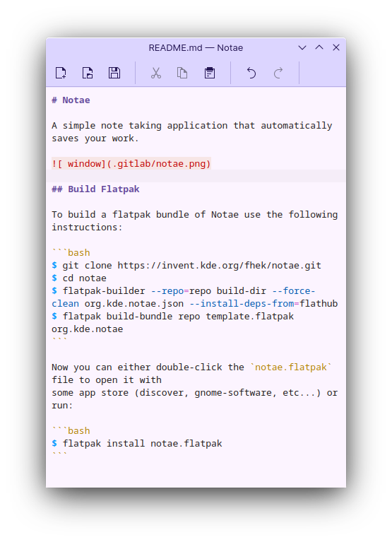

# Notae

A simple note taking application that automatically saves your work.



## Build Flatpak

To build a flatpak bundle of Notae use the following instructions:

```bash
$ git clone https://invent.kde.org/utilities/notae.git
$ cd notae
$ flatpak-builder --repo=repo build-dir --force-clean .flatpak-manifest.json --install-deps-from=flathub
$ flatpak build-bundle repo template.flatpak org.kde.notae
```

Now you can either double-click the `notae.flatpak` file to open it with
some app store (discover, gnome-software, etc...) or run:

```bash
$ flatpak install notae.flatpak
```
